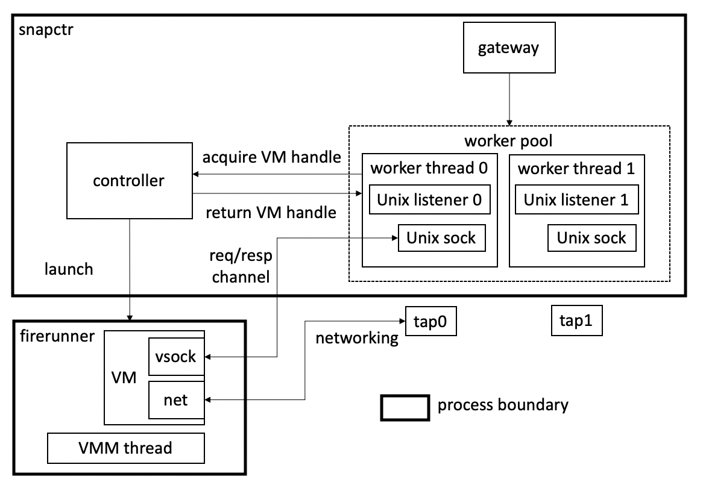

# Machine Setup
SnapFaaS depends on `docker` so make sure `docker` is installed.
## launch docker service
With `docker` installed, start `dockerd`:
```bash
sudo groupadd docker
sudo service docker start
sudo usermod -aG docker $USER
```
The last line gives access permissions to `$USER`
but requires the user to log out the current ssh session and then log back in
to take effect.
## network setup
SnapFaaS uses `docker0` bridge. `docker0` should be automatically
up when `docker` service is launched.
```bash
scripts/setup-tap-bridge.sh NUMBER_OF_TAPS
```
The command aboves sets up NUMBER_OF_TAPS tap devices.
# Initialize Submodules
```bash
git submodule init
git submodule update
```
# Build Binaries
This repo contains binaries `snapctr`, `fc_wrapper`, and `firerunner`.

To build binary `snapctr`, execute
```bash
cargo build --release --bin snapctr
```
To build binary `fc_wrapper`, execute
```bash
cargo build --release --bin fc_wrapper
```
To build binary `firerunner`, execute
```bash
cargo build --release --bin firerunner
```

Following the instructions above places all binaries under `target/release` directory.

# Build Root Filesystems and Application Filesystems
SnapFaaS uses `docker` to build both kinds of filesystems.
The Linux distro used is Alpine Linux v3.10.
## root filesystem
Currently only Python3.7 is supported. To build a root filesystem for Python3.7, execute
```bash
cd snapfaas-images/separate
# replace the path `/ssd/rootfs/python3.ext4` with the path at which you want to place the root filesystem.
./mk_rt_images python3-net-vsock /ssd/rootfs/python3.ext4
```
## application filesystem
```bash
# use hello as example
cd snapfaas-images/appfs/hellopy2
make
```
The command above generates `output.ext2` in the `hellopy2` directory.

# Execution
`firerunner` should *not* be directly executed through command line.

`snapctr` and `fc_wrapper` both internally execute `firerunner` binary. `firerunner` binary is
expected to be at `target/release` directory, which is the case if the build instructions above are followed.

## launch a single VM or generate snapshots
`fc_wrapper` launches a single VM instance and reads in requests from `stdin`.
It is good for testing out new language and new applications.
Users should use `fc_wrapper` to generate VM snapshots.

0. Before executing `fc_wrapper`, make sure `tap0` exists on the host by running
```bash
scripts/setup-tap-bridge.sh 1
```
1. To conduct a regular boot, execute:
```bash
# run hello function
sudo target/release/fc_wrapper \
    --kernel resources/vmlinux-4.20.0 \
    --rootfs /ssd/ext4/python3.ext4 \
    --appfs snapfaas-images/appfs/hellopy2/output.ext2 \
    --network 'tap0/ff:ff:ff:ff:ff:ff' \
    --mem_size 128 \
    --vcpu_count 1 < resources/json-hello
```
2. To generate a Python3 snapshot, execute:
```bash
# create the target snapshot directory
mkdir /ssd/snapshots/python3
# generate a snapshot
sudo target/release/fc_wrapper \
    --kernel resources/vmlinux-4.20.0 \
    --rootfs /ssd/ext4/python3.ext4 \
    --appfs snapfaas-images/appfs/empty/output.ext2 \
    --network 'tap0/ff:ff:ff:ff:ff:ff' \
    --mem_size 128 \
    --vcpu_count 1 \
    --dump_dir /ssd/snapshots/python3
```
When users see the line "Snapshot generation succeeds",
they should Ctrl-C to terminate the process as the process
won't exit on itself currently.

3. To generate a diff snapshot for a function, execute:
```bash
# create the target snapshot directory
mkdir /ssd/snapshots/diff/hello
# generate the diff snapshot
sudo target/release/fc_wrapper \
    --kernel resources/vmlinux-4.20.0 \
    --rootfs /ssd/ext4/python3.ext4 \
    --appfs snapfaas-images/appfs/hellopy2/output.ext2 \
    --network 'tap0/ff:ff:ff:ff:ff:ff' \
    --mem_size 128 \
    --vcpu_count 1 \
    --load_dir /ssd/snapshots/python3 \
    --dump_dir /ssd/snapshots/diff/hello
```
4. To boot a VM from a snapshot, execute:
```bash
# run hello function
sudo target/release/fc_wrapper \
    --kernel resources/vmlinux-4.20.0 \
    --rootfs /ssd/ext4/python3.ext4 \
    --appfs snapfaas-images/appfs/hellopy2/output.ext2 \
    --network 'tap0/ff:ff:ff:ff:ff:ff' \
    --mem_size 128 \
    --vcpu_count 1 \
    --load_dir /ssd/snapshots/python3 \
    --diff_dirs /ssd/snapshots/diff/hello < resources/json-hello
```

5. For debugging, one can turn on guest VM console allowing guest VM output,
```bash
sudo target/release/fc_wrapper \
    --kernel resources/vmlinux-4.20.0 \
    --kernel_args 'console=ttyS0' \
    --rootfs /ssd/ext4/python3.ext4 \
    --appfs snapfaas-images/appfs/hellopy2/output.ext2 \
    --network 'tap0/ff:ff:ff:ff:ff:ff' \
    --mem_size 128 \
    --vcpu_count 1 < resources/json-hello
```
## `snapctr` quick try-out
To quickly try out `snapctr`, run
```bash
scripts/run-snapctr-example.sh
```

## `snapctr` setup details
### `snapctr` command
`snapctr` should be used to run a single machine macrobenchmark. It always takes three arguments:
1. --config \<**absolute path** to controller configuration file\> (e.g., `resources/example-controller-config.yaml`). The config file specifies:
```txt
kernel_path: url to the uncompressed kernel binary
runtimfs_dir: url to root filesystem base directory
appfs_dir: url to application filesystem base directory
snapshot_dir: url to snapshot base directory
function_config: url to function configuration file
```
2. --mem <total memory available to this `snapctr`\>
3. --requests_file \<a regular json file contains a workload\>,
example workload file: `resources/example-requests.json`.

### `snapctr` architecture

`snapctr` currently statically registers all functions listed 
in the function configuration file (e.g., `resources/example-function-configs.yaml`)
and assumes that all functions require the same VM size. It 
statically creates `total memory/VM size` worker threads at 
initialization time.

### clean up unix domain socket listeners
Each worker thread holds at most one VM handle at a time. It 
holds a unix domain socket that sends requests to and receives 
responses from the VM. Such a connection is established by the 
guest VM connects to the Unix domain socket listener unique to 
each worker thread. All Unix domain socket listeners must be 
removed after `snapctr` exits (see the last line in `scripts/run-snapctr-example.sh`).

### right number of tap devices must exist
Each guest VM has the network interface `eth0` configured. 
Each `eth0` is backed by a unique tap device pre-configured on 
the host. Each tap device is associated with a worker thread. 
`scripts/setup-tap-bridge.sh NUMBER_OF_TAPS` does the job.
In addition, `scripts/cleanup-taps.sh NUMBER_OF_TAPS` removes 
all tap devices previously created.

### function configuration file
A function config file specifies:
```txt
name: function name
runtimefs: root filesystem name, expected to be under `runtimefs_dir` specified in controller config file.
appfs: application filesystem name, expected to be under `appfs_dir` specified in controller config file.
vcpus: number of vcpus,
memory: VM memory size,
concurrency_limit: not in use
copy_base: whether copy base snapshot memory dump
copy_diff: whether copy diff snapshot memory dump
load_dir: **optional**, base snapshot name, expected to be under `snapshot_dir` specified in controller config file.
diff_dirs: **optional**, comma-separated list of diff snapshot names, expected to be under `snapshot_dir`/diff
```
Note that "optional" means that the fields do not need to 
exist. If load_dir and diff_dirs exist, then the function is 
booted from its base + diff snapshots. If they are missing, 
then the function goes through the regular boot process.
